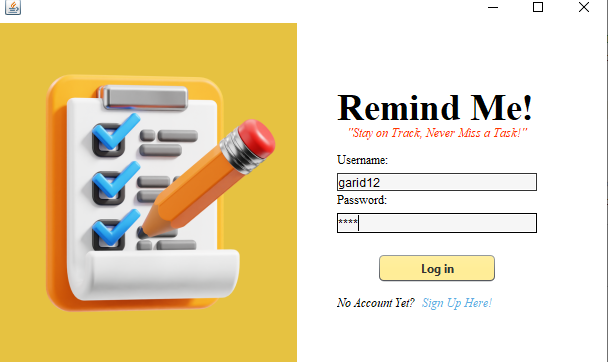
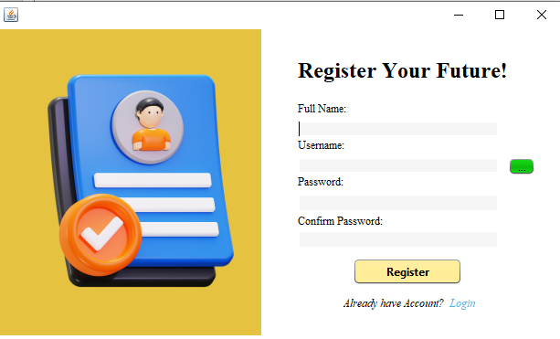
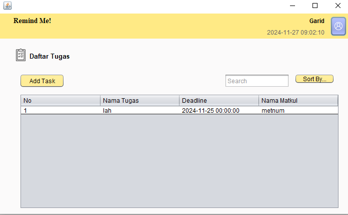
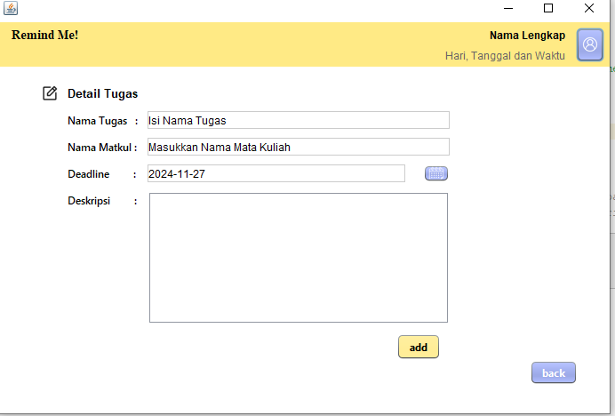
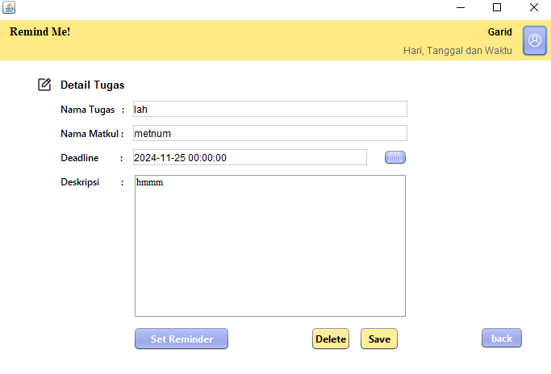

# RemindMe!

Project Akhir Pemrograman Berbasis Object

### Bahasa yang digunakan
- Java

### Fitur Utama
Aplikasi yang berguna untuk menyimpan serta memberitahu pengguna tentang tugas yang dimiliki
- User Manajemen
- Manajemen Tugas
- Notifikasi Pengingat

### Kelompok Sangar Bijaksana (Sarjana):
- Farid Noer Hakim (2310631170081)
- Surya Kamal (2310631170051)
- Faishal Muhammad F (2310631170135)
- Dimas Agung Fitriyanto (2310631170075)

Universitas Singaperbangsa Karawang

### Screenshot

